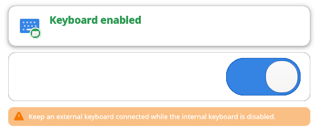
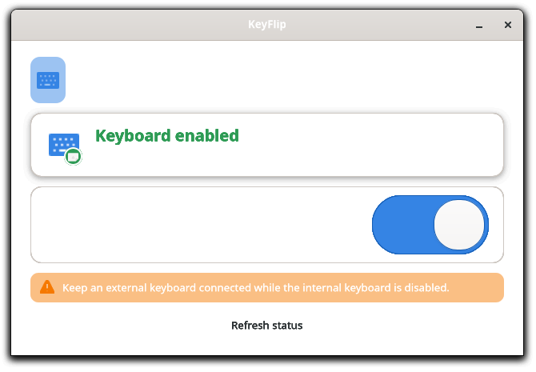

# ✨ KeyFlip
**KeyFlip** is a small GNOME utility for enabling or disabling a supported laptop's internal keyboard.

Useful when you're using an external keyboard and want to avoid accidental input from the built-in one.

## Screenshots

### Keyboard status and control



### KeyFlip app



### Enabled keyboard state


## Features

- Toggle the internal laptop keyboard on or off
- Optionally disable it when a USB or Bluetooth keyboard connects, then
  re-enable it when the last external keyboard disconnects
- Warn before manual disabling when no external keyboard is detected
- Works on **Wayland** and **X11**
- Does not affect external USB keyboards
- Does not affect Bluetooth keyboards
- Simple GNOME interface

## Requirements

Currently built and tested for:

- Fedora Linux
- GNOME
- Python 3
- GTK 4 / `python3-gobject`
- `polkit`
- `util-linux`
- `systemd`
- Standard **i8042/AT internal keyboards**

### Supported

- ✅ i8042/AT internal keyboards
- ✅ Wayland
- ✅ X11
- ✅ USB keyboards remain enabled
- ✅ Bluetooth keyboards remain enabled

### Not currently supported

- ❌ Internal USB keyboards
- ❌ Internal I2C keyboards

## Install

Download and extract:

`keyflip-0.2.0-beta.tar.gz`

Open a terminal inside the extracted folder. To install both interfaces, run:

```bash
sudo ./install.sh
```

The GUI and GNOME Shell extension are separate front ends backed by the same
privileged core. You can install only the interface you want:

```bash
sudo ./install.sh --gui-only
sudo ./install.sh --extension-only
sudo ./install.sh --core-only
```

Distribution packages use the same split:

- `keyflip-core` — shared helper, Polkit policy, and sounds
- `keyflip` — GTK 4 desktop application
- `gnome-shell-extension-keyflip` — GNOME top-bar indicator

Both front-end packages depend on `keyflip-core`, and they may be installed
together or independently.

Component-specific removal is also supported:

```bash
sudo ./uninstall.sh --gui-only
sudo ./uninstall.sh --extension-only
sudo ./uninstall.sh             # remove everything
```

## AI-assisted development

KeyFlip was developed with help from AI tools for coding, debugging, documentation, and learning.

I review, test, modify, and take responsibility for everything released in this project.

## Status

**Version:** `0.2.0-beta`

KeyFlip is still in active development. Bug reports and feedback are welcome.
